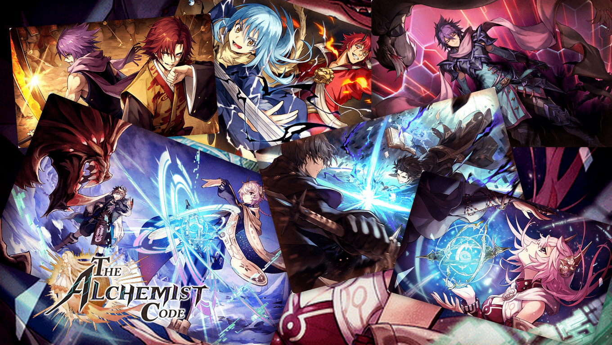
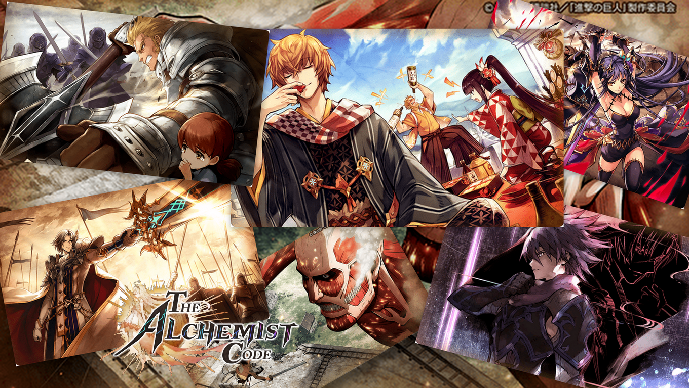

# Welcome To My Github Page

<!-- PROJECT LOGO -->
 

  <h3 align="center">My-Landing-Page</h3>

  

    An awesome README template to jumpstart your projects!
  

    
   
   
   
    
  

    <a href="https://www.instagram.com/doniindira/?hl=en"><strong>Check My Instagram»</strong></a>
     
     
    <a href="https://github.com/othneildrew/Best-README-Template">View Demo</a>
    ·
    <a href="https://github.com/othneildrew/Best-README-Template/issues">Report Bug</a>
    ·
    <a href="https://github.com/othneildrew/Best-README-Template/issues">Request Feature</a>
  

    

  

# My Favorite Game 

![Product Name Screen Shot][pict-wall]

* The Alchemist Code  = [Link](https://play.google.com/store/apps/details?id=sg.gumi.alchemistww&hl=en&gl=US)
* Genshin Impact      = [Link](https://play.google.com/store/apps/details?id=com.miHoYo.GenshinImpact&hl=en&gl=US)

[pict-wall]: img/NicePng_nba-2k18-png_923535.png
[wall-1]: img/MEME1.png
[wall-2]: img/MEME2.png
[wall-3]: img/MEME3.png
[wall-4]: img/MEME4.png
